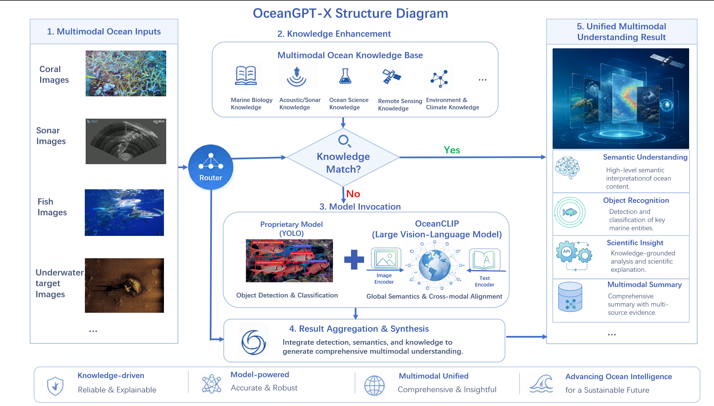

# OceanGPT-X

OceanGPT-X is an **intelligent marine image recognition service** under the OceanGPT project, providing a unified multi-model inference API for marine biology research, underwater robot vision, and sonar image interpretation. By following the steps below, you can go from a clean machine with no dependencies or models installed to a fully running API service — and start receiving species-level identification results for marine images via REST API or the Web frontend.


## Architecture

OceanGPT-X employs a **multi-model fusion inference** strategy, combining FAISS vector retrieval, OceanCLIP (a marine-adapted vision-language model fine-tuned from BioCLIP), and a suite of YOLOv5/YOLOv11-cls detection and classification models for efficient and accurate image recognition.

### Inference Pipeline

For each input image, the system processes as follows:

1. **FAISS Vector Retrieval** — Uses BioCLIP pre-trained features to search the retrieval database. If similarity exceeds the threshold (default 0.90), returns the match directly, skipping further inference.
2. **Router Classifier** — If no match is found, a YOLOv11-cls router model classifies the image as "sonar" or "biological".
3. **Branch Inference**:
   - **Sonar branch**: A YOLOv5 classifier categorizes sonar targets into 15 classes (e.g., side-scan sonar, multibeam, cube).
   - **Biological branch**: A YOLOv5 fish/coral binary classifier determines the category, then either a fish detector or coral detector performs fine-grained species identification.
4. **Cross-Validation Fusion** — In the biological branch, the detector result is cross-validated against OceanCLIP's Top-N matches at the genus level. If they agree, a fused result is output (source: `oceanclip+detector`); otherwise OceanCLIP takes priority; if OceanCLIP is unavailable, the detector result is used as fallback.

### Overview



## Models

All model weights and data files are hosted in the [OceanGPT-X Collection](https://huggingface.co/collections/zjunlp/oceangpt-x) on Hugging Face:

| Repository | Model File | Task | Architecture | Classes |
|-----------|-----------|------|-------------|---------|
| [zjunlp/Ocean-router](https://huggingface.co/zjunlp/Ocean-router) | `cls_bio_sonar/best.pt` | Sonar vs. Bio routing | YOLOv11-cls | 2 |
| [zjunlp/Ocean-router](https://huggingface.co/zjunlp/Ocean-router) | `fish_coral_cls/best.pt` | Fish vs. Coral binary | YOLOv5 | 2 |
| [zjunlp/Ocean-yolo](https://huggingface.co/zjunlp/Ocean-yolo) | `fish_detector/best.pt` | Fish species detection | YOLOv5 | Multi-class |
| [zjunlp/Ocean-yolo](https://huggingface.co/zjunlp/Ocean-yolo) | `coral_detector/best.pt` | Coral species detection | YOLOv5 | Multi-class |
| [zjunlp/Ocean-yolo](https://huggingface.co/zjunlp/Ocean-yolo) | `sonar_detector/best.pt` | Sonar target detection | YOLOv5 | 15 |
| [zjunlp/OceanCLIP-0.15B](https://huggingface.co/zjunlp/OceanCLIP-0.15B) | `oceanclip-bio/epoch_50.pt` | Zero-shot species ID | CLIP (ViT-B/16) | Term-driven |
| [zjunlp/OceanCLIP-0.15B](https://huggingface.co/zjunlp/OceanCLIP-0.15B) | `bioclip/open_clip_pytorch_model.bin` | BioCLIP base weights | CLIP (ViT-B/16) | — |
| [zjunlp/Ocean-FAISS](https://huggingface.co/zjunlp/Ocean-FAISS) | `faiss/index.faiss` | FAISS retrieval index | — | — |
| [zjunlp/Ocean-FAISS](https://huggingface.co/zjunlp/Ocean-FAISS) | `metadata/metadata.jsonl` | Image metadata (species, location, capture info) | — | — |

## Launch API Server

Follow the steps below to deploy the service from scratch and start the API server.

### 1. Install Dependencies

Create and activate a conda virtual environment with all Python dependencies:

```bash
conda env create -f environment.yml
conda activate marine-api
```

### 2. Clone YOLOv5 Source Code

Required for loading YOLOv5-format models (sonar, fish, coral):

```bash
git clone https://github.com/ultralytics/yolov5 ./yolov5
```

Default clone to `./yolov5` for auto-detection. If using a different path, set the `YOLOV5_DIR` environment variable.

### 3. Download Models & Data

All model weights and data files are hosted on Hugging Face:
**[huggingface.co/collections/zjunlp/oceangpt-x](https://huggingface.co/collections/zjunlp/oceangpt-x)**

```bash
python scripts/download_assets.py
```

This downloads:
- 7 model weights (Router, Sonar classifier, Fish/Coral binary, Fish detector, Coral detector, OceanCLIP checkpoint + terms)
- BioCLIP base model for feature encoding
- FAISS retrieval index
- Metadata for image lookup

Custom download directory:

```bash
python scripts/download_assets.py --download-dir ./my-models
```

### 4. Configure Environment (Optional)

All paths default to the `downloaded_assets/` directory created by the download script.
**No manual configuration is required to start the service.**

Only set environment variables if you use custom paths:

```bash
export YOLOV5_DIR=/path/to/yolov5
```

To adjust inference parameters:

```bash
export THRESHOLD=0.85
export TOPK=10
```

### 5. Start the Server

Launch the FastAPI server, listening on `0.0.0.0:8000` (the port can be changed in the command below, and must match the port used in subsequent API calls):

```bash
uvicorn app.main:app --host 0.0.0.0 --port 8000
```

Development mode with auto-reload:

```bash
uvicorn app.main:app --host 0.0.0.0 --port 8000 --reload
```

Once started, the service runs at `http://localhost:8000`.

## Launch Web Frontend

An interactive Streamlit web demo is provided for easy image upload and result viewing without using curl or code:

```bash
streamlit run streamlit/demo.py
```

Open the local address shown in the terminal (typically `http://localhost:8501`) in your browser to start using it.

## API Usage Guide

This service provides a RESTful API. The port `8000` used in all examples below must match the `--port` value specified when starting the server.

### Health Check

```
GET /health
```

Returns the loading status of each model module, useful for verifying the service started correctly.

### Prediction

```
POST /predict
```

| Field | Type  | Description    |
|-------|-------|----------------|
| file  | image | Image to classify |

**Example:**

```bash
curl -X POST http://localhost:8000/predict -F "file=@test/soner_cube.png"
```

Or open `http://localhost:8000/docs` (port must match the server's `--port`) for interactive API documentation where you can upload test images directly in the browser.

## Configuration

All configuration is managed via environment variables, defined in `app/core/config.py`. On startup, the service automatically reads `.env` from the project root if it exists. Variables can also be set temporarily via `export` in the terminal.

Key environment variables:

| Variable | Default | Description |
|----------|---------|-------------|
| `THRESHOLD` | `0.90` | FAISS retrieval similarity threshold |
| `ROUTER_THRESHOLD` | `0.5` | Probability threshold for sonar routing |
| `USE_OCEANCLIP` | `true` | Enable OceanCLIP species identification |
| `TOPK` | `5` | Number of FAISS retrieval results |
| `DEVICE` | `cuda` | Computation device (`cuda` or `cpu`) |
| `YOLOV5_DIR` | `./yolov5` | YOLOv5 source directory |

## Project Structure

```
app/
  api/          # FastAPI routes (/health, /predict)
  core/         # Configuration and global state
  services/     # Model loading, retrieval, classification, fusion
  main.py       # Application entry point
scripts/
  download_assets.py  # One-command model + data downloader
streamlit/
  demo.py       # Streamlit demo UI
test/           # Sample test images
```

## Test Samples

4 test images are provided in `test/`:

- `test/coral_Acropora Cervicornis_1.png` — Coral (Acropora cervicornis)
- `test/fish_Amphiprion_clarkii_62.png` — Fish (Amphiprion clarkii)
- `test/soner_cube.png` — Sonar (cube)
- `test/fish.png` — Out-of-domain fish (aquarium white background)

## Note

This repository does not include model weights or data files. Download them via `scripts/download_assets.py`. All paths default to the download script's output directory — zero configuration needed.
