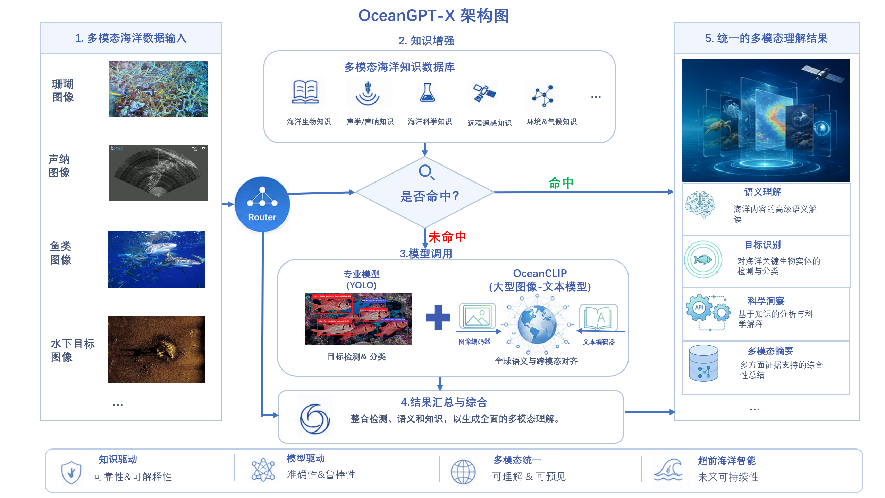

# OceanGPT-X

OceanGPT-X 是隶属于 OceanGPT 项目的**海洋图像智能识别服务**，面向海洋生物研究、水下机器人视觉、声呐图像解译等场景提供多模态、多模型的统一推理 API。用户只需依次执行部署步骤，即可从一个完全没有环境依赖和模型安装的状态启动 API 服务，并通过 REST API 或 Web 前端界面上传海洋图像，获得物种级识别结果。


## 架构与简介

OceanGPT-X 采用**多模型融合推理**策略，结合 FAISS 向量检索、OceanCLIP（基于 BioCLIP 微调的海洋视觉-语言模型）以及一组 YOLOv5/YOLOv11-cls 专用检测与分类模型，实现对输入图像的高效、精准识别。

### 识别流程

对于每张输入图像，系统按以下流程处理：

1. **FAISS 向量检索** — 首先使用 BioCLIP 预训练特征在检索库中查找相似图像。若相似度超过阈值（默认 0.90），直接返回匹配结果，跳过后续推理。
2. **路由分类器（Router）** — 若检索未命中，YOLOv11-cls 路由模型将图像二分类为"声呐（sonar）"或"生物（biological）"。
3. **分支推理**：
   - **声呐分支**：YOLOv5 声呐分类器对 15 类声呐目标进行分类（如侧扫声呐、多波束、cube 等）。
   - **生物分支**：先经 YOLOv5 鱼/珊瑚二分类器判断大类，再分别调用鱼类检测器或珊瑚检测器进行细粒度物种识别。
4. **交叉验证融合** — 生物分支中，系统将检测器的结果与 OceanCLIP 的 Top-N 匹配项进行属级（genus-level）交叉验证。若两者一致，输出融合结果（source: `oceanclip+detector`）；否则以 OceanCLIP 结果为主；若 OceanCLIP 不可用，则回退至检测器结果。

### 架构总览



## 模型列表

所有模型权重与数据文件托管在 Hugging Face 的 [OceanGPT-X Collection](https://huggingface.co/collections/zjunlp/oceangpt-x) 中：

| 模型仓库 | 模型文件 | 任务 | 架构 | 类别数 |
|---------|---------|------|------|-------|
| [zjunlp/Ocean-router](https://huggingface.co/zjunlp/Ocean-router) | `cls_bio_sonar/best.pt` | 声呐 vs 生物路由 | YOLOv11-cls | 2 |
| [zjunlp/Ocean-router](https://huggingface.co/zjunlp/Ocean-router) | `fish_coral_cls/best.pt` | 鱼类 vs 珊瑚二分类 | YOLOv5 | 2 |
| [zjunlp/Ocean-yolo](https://huggingface.co/zjunlp/Ocean-yolo) | `fish_detector/best.pt` | 鱼类物种检测 | YOLOv5 | 多类 |
| [zjunlp/Ocean-yolo](https://huggingface.co/zjunlp/Ocean-yolo) | `coral_detector/best.pt` | 珊瑚物种检测 | YOLOv5 | 多类 |
| [zjunlp/Ocean-yolo](https://huggingface.co/zjunlp/Ocean-yolo) | `sonar_detector/best.pt` | 声呐目标检测 | YOLOv5 | 15 |
| [zjunlp/OceanCLIP-0.15B](https://huggingface.co/zjunlp/OceanCLIP-0.15B) | `oceanclip-bio/epoch_50.pt` | 海洋物种零-shot识别 | CLIP (ViT-B/16) | 术语表驱动 |
| [zjunlp/OceanCLIP-0.15B](https://huggingface.co/zjunlp/OceanCLIP-0.15B) | `bioclip/open_clip_pytorch_model.bin` | BioCLIP 基础权重（特征编码） | CLIP (ViT-B/16) | — |
| [zjunlp/Ocean-FAISS](https://huggingface.co/zjunlp/Ocean-FAISS) | `faiss/index.faiss` | FAISS 检索索引 | — | — |
| [zjunlp/Ocean-FAISS](https://huggingface.co/zjunlp/Ocean-FAISS) | `metadata/metadata.jsonl` | 图像元数据（物种、位置、采集信息） | — | — |

## 部署并启动 API 服务

依次执行以下步骤，你可以从一个没有任何环境依赖和模型安装的状态成功部署服务，并启动 API 接口。

### 1. 安装环境依赖

创建并激活 conda 虚拟环境，安装所有 Python 依赖包：

```bash
conda env create -f environment.yml
conda activate marine-api
```

### 2. 克隆 YOLOv5 源码

鱼类、珊瑚、声呐模型均为 YOLOv5 格式，需要 YOLOv5 源码来加载推理模块：

```bash
git clone https://github.com/ultralytics/yolov5 ./yolov5
```

默认克隆到 `./yolov5` 即可自动识别。若使用其他路径，需设置 `YOLOV5_DIR` 环境变量。

### 3. 下载模型权重与数据文件

所有模型权重和索引数据均托管在 Hugging Face 上：
**[huggingface.co/collections/zjunlp/oceangpt-x](https://huggingface.co/collections/zjunlp/oceangpt-x)**

运行以下命令一键下载：

```bash
python scripts/download_assets.py
```

该脚本会下载：
- 7 个模型权重（Router、声呐分类器、鱼类/珊瑚二分类、鱼类检测器、珊瑚检测器、OceanCLIP 微调权重 + 术语表）
- BioCLIP 基础模型（用于 FAISS 特征编码）
- FAISS 检索索引
- 元数据文件

自定义下载目录：

```bash
python scripts/download_assets.py --download-dir ./my-models
```

### 4. 配置环境变量（可选）

所有路径默认指向 `downloaded_assets/` 目录（下载脚本自动创建），**无需手动配置即可启动**。

仅在以下情况需要设置环境变量：

- YOLOv5 克隆到了非默认路径：
  ```bash
  export YOLOV5_DIR=/path/to/yolov5
  ```
- 调整推理参数：
  ```bash
  export THRESHOLD=0.85
  export TOPK=10
  ```

### 5. 启动服务

启动 FastAPI 服务，监听 `0.0.0.0:8000`（端口号可在命令中修改，需与后续 API 调用时使用的端口保持一致）：

```bash
uvicorn app.main:app --host 0.0.0.0 --port 8000
```

开发模式（支持热更新）：

```bash
uvicorn app.main:app --host 0.0.0.0 --port 8000 --reload
```

启动成功后，服务将持续运行在 `http://localhost:8000`。

## 启动 Web 前端服务

服务提供基于 Streamlit 的交互式 Web 演示界面，方便用户直接上传图片并查看识别结果：

```bash
streamlit run streamlit/demo.py
```

运行后在浏览器中打开提示的本地地址（通常为 `http://localhost:8501`）即可使用。

## API 接口使用介绍

本服务提供 RESTful API 接口。以下示例中使用的端口号 `8000` 需与启动服务时指定的 `--port` 参数保持一致。

### 健康检查

```
GET /health
```

返回各模型模块的加载状态，用于确认服务是否正常启动。

### 预测接口

```
POST /predict
```

| 字段 | 类型  | 说明     |
|------|-------|----------|
| file | image | 待识别的图片 |

**使用示例：**

```bash
curl -X POST http://localhost:8000/predict -F "file=@test/soner_cube.png"
```

或打开 `http://localhost:8000/docs`（端口号需与启动时一致）查看交互式 API 文档，可直接在浏览器中上传测试图片。

## 配置说明

所有配置通过环境变量管理，定义在 `app/core/config.py` 中。服务启动时会自动读取项目根目录下的 `.env` 文件（如果存在），也可以通过 `export` 命令在终端中临时设置。

关键环境变量：

| 变量 | 默认值 | 说明 |
|------|--------|------|
| `THRESHOLD` | `0.90` | FAISS 检索相似度阈值 |
| `ROUTER_THRESHOLD` | `0.5` | 声呐分类概率阈值，高于此值判定为声呐图 |
| `USE_OCEANCLIP` | `true` | 是否启用 OceanCLIP 物种级识别 |
| `TOPK` | `5` | FAISS 返回的最邻近数量 |
| `DEVICE` | `cuda` | 计算设备（`cuda` 或 `cpu`） |
| `YOLOV5_DIR` | `./yolov5` | YOLOv5 源码目录 |

## 项目结构

```
app/
  api/          # FastAPI 路由（/health, /Predict）
  core/         # 配置与全局状态
  services/     # 模型加载、检索、分类、融合等核心逻辑
  main.py       # 应用入口
scripts/
  download_assets.py  # 一键下载所有模型和数据文件
streamlit/
  demo.py       # Streamlit Web 演示界面
test/           # 测试样例图片
```

## 测试样例

`test/` 目录下提供 4 张测试图片：

- `test/coral_Acropora Cervicornis_1.png` — 珊瑚（Acropora cervicornis）
- `test/fish_Amphiprion_clarkii_62.png` — 鱼类（Amphiprion clarkii）
- `test/soner_cube.png` — 声呐（cube）
- `test/fish.png` — 域外风格鱼图（水族箱白背景）

## 说明

本仓库不包含模型权重和数据文件，请通过 `scripts/download_assets.py` 下载。所有路径默认指向下载脚本的输出目录，零配置即可启动。
